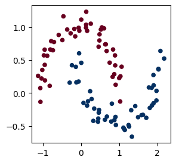
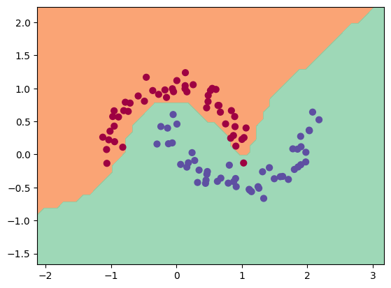
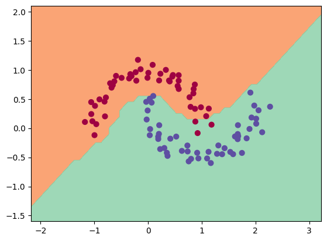
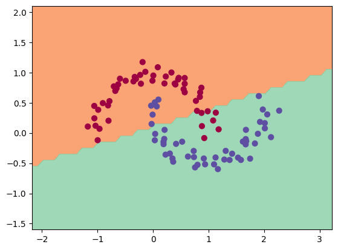
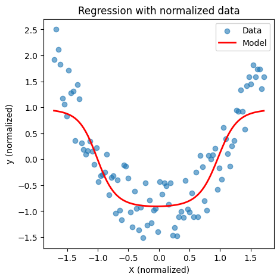

> a lightweight autograd engine coded in pure python (strongly) inspired by [Karpathy's video](https://www.youtube.com/watch?v=VMj-3S1tku0), to demistify backpropagation as an educational exercise. 

## Key Features
* **Scalar-valued autograd engine**: implements backpragation from scratch
* **Multiple activation functions**: added as an exercise sigmoid, tanh, relu to understand the differences in our models
* **Visualization**: original DAG from Karpathy's micrograd 

## What the Value class does
```python
from micrograd.engine import Value

# Build a small expression graph
a = Value(-4.0)
b = Value(2.0)
c = a + b
d = a * b + b**3
c += c + 1
c += 1 + c + (-a)
d += d * 2 + (b + a).relu()
d += 3 * d + (b - a).tanh()
e = c - d
f = e**2
g = f / 2.0
g += 10.0 / f

# Backward pass (calculate gradients)
g.backward()

print(f"{a.grad=}") # Prints the gradient of a
````
## Training a neural network
The "demos" folder offers examples of neural nets used on binary classification (the orginal one, but trained with several lossfunctions and activation functions to understand differences), and regression. 

I coded sevral functions: loss(), train(), visualize(), to simplify training on different models. 

### The data set I worked on (sckitlearn.datasets.make_moons)


### Using a 16x16 MLP with relu and max_margin


### Using a 16x16 MLP with tanh and MSE


### Using a linear model (just to show that without an act function, every mlp is linear)


### Now solving a simple regression problem (not optimal bc of the way we calculate the loss, but there is the idea)


> The tracing function (draw_dot()), and running tests is very similar to Karpathy's micrograd.